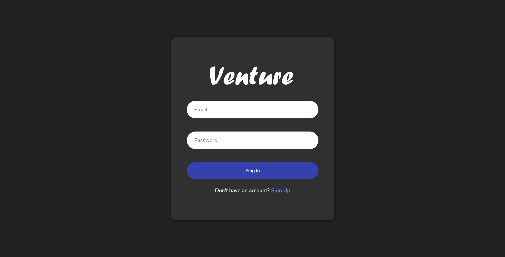
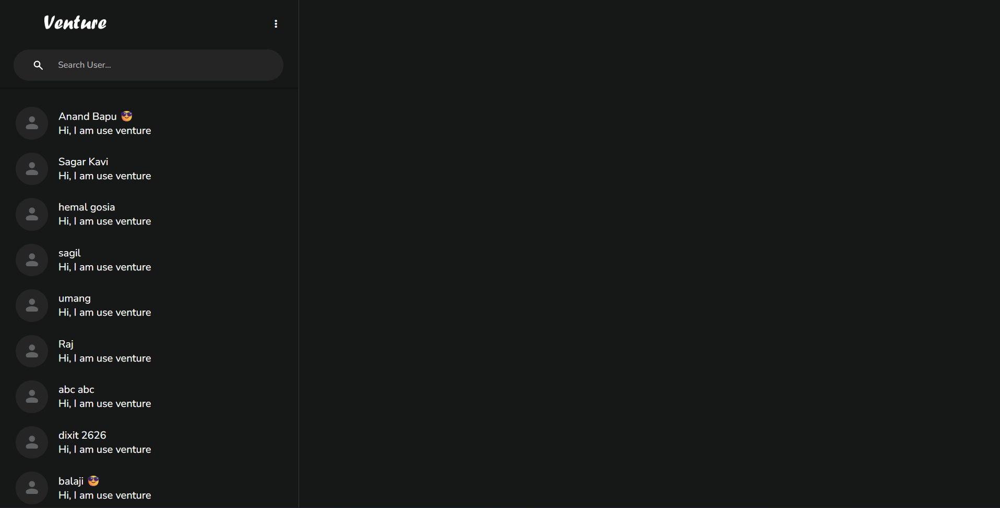
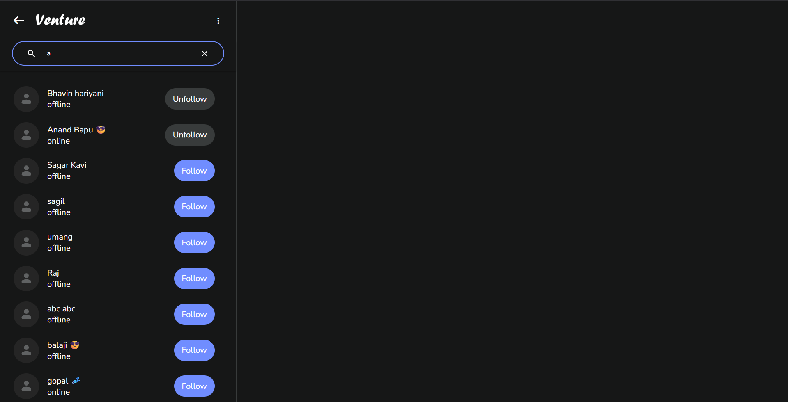

# 💬 Real-Time Chat Application

A full‑stack **real‑time chat application** built using **HTML, CSS, JavaScript, Python (Flask + Socket.IO), and MongoDB**. This project demonstrates how to create a modern chat app with real‑time messaging, user authentication, and message persistence.

---


---

---

---

---

## 🚀 Features

* 🔐 User Registration & Login
* 💬 Real-time messaging using **Flask-SocketIO**
* 👥 One-to-one chat support
* 🟢 Online / Offline user status
* 🕒 Message timestamps
* 💾 Chat history stored in **MongoDB**
* 📱 Responsive UI

---

## 🛠️ Tech Stack

### Frontend

* HTML5
* CSS3
* JavaScript (Vanilla JS)

### Backend

* Python
* Flask
* Flask-SocketIO

### Database

* MongoDB

---

## 📁 Project Structure

```
chatapp/
│
├── app                    # Main Flask application
│    ├── routes/                # python file
│    │  ├── auth.py
│    │  ├── chat.py
│    │  └── socket_events.py
│    ├── static/
│    │  ├── css/
│    │  │   └── style.css      # App styling
│    │  └── js/
│    │      ├── script.js        other logic for chat app 
│    │      └── search.js        # user search logic
│    ├──  image/ ...
│    ├── templates/
│    │   ├── base.html          # base file
│    │   ├── login.html         # Login page
│    │   ├── register.html      # Register page
│    │   └── index.html          # Chat UI and main page
│    ├── __init__.py
│    └── forms.py
├── run.py
├── requirements.txt       # Python dependencies
└── README.md              # Project documentation
```

---

## ⚙️ Installation & Setup

### 1️⃣ Clone the Repository

```bash
git clone https://github.com/BHAVIN-Hariyani-001b/chatapp.git
cd chatapp
```

### 2️⃣ Create Virtual Environment

```bash
python -m venv venv
venv\Scripts\activate   # Windows
source venv/bin/activate # Linux/Mac
```

### 3️⃣ Install Dependencies

```bash
pip install -r requirements.txt
```

### 4️⃣ Update MongoDB Url

Update **__inti__.py**:

```python
MONGO_URI = "mongodb+srv://<username>:<password>@<cluster-url>/<database-name>?retryWrites=true&w=majority"
SECRET_KEY = "your_secret_key"
```

Make sure MongoDB is running.

### 5️⃣ Run the Application

```bash
python run.py
```

Open browser:

```
http://127.0.0.1:5000
```

---

## 🔌 Socket.IO Events

| Event           | Description       |
| --------------- | ----------------- |
| connect         | User connected    |
| disconnect      | User disconnected |
| send_message    | Send chat message |
| receive_message | Receive message   |

---

## 📦 requirements.txt

```
flask
flask-socketio
pymongo
python-dotenv
eventlet
```

---

## 📸 Screenshots (Optional)

Add screenshots of:

* Login Page
* Chat Interface

---

## 🔮 Future Enhancements

* ✅ Group Chat
* 📎 File & Image Sharing
* 🔔 Push Notifications
* 🧑 Profile Pictures
* 🔒 JWT Authentication
---

## 🤝 Contributing

Contributions are welcome!

1. Fork the repo
2. Create a new branch
3. Commit your changes
4. Open a Pull Request

---

## 📄 License

This project is licensed under the **MIT License**.

---

## ⭐ Support

If you like this project, give it a ⭐ on GitHub!

---

**Made with ❤️ using Flask & Socket.IO**
